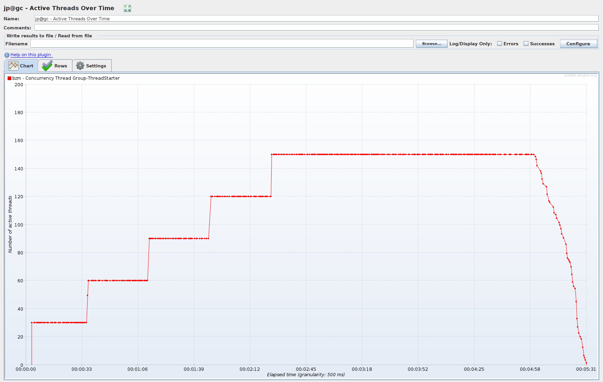
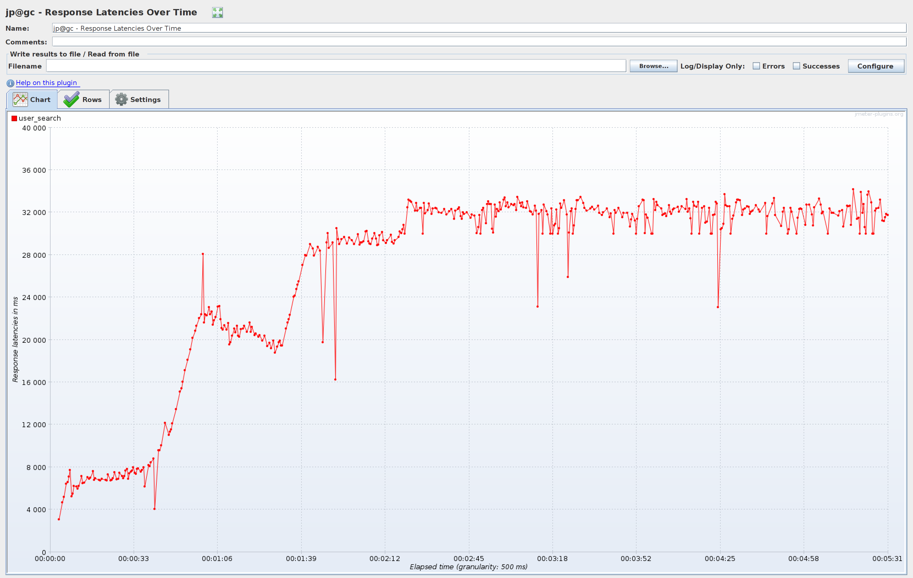
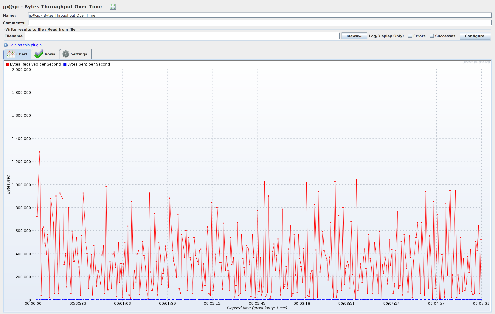
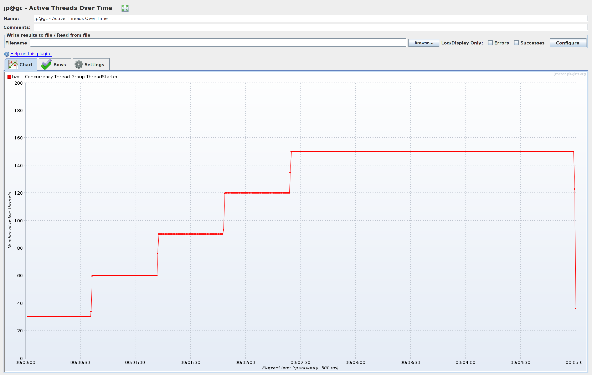
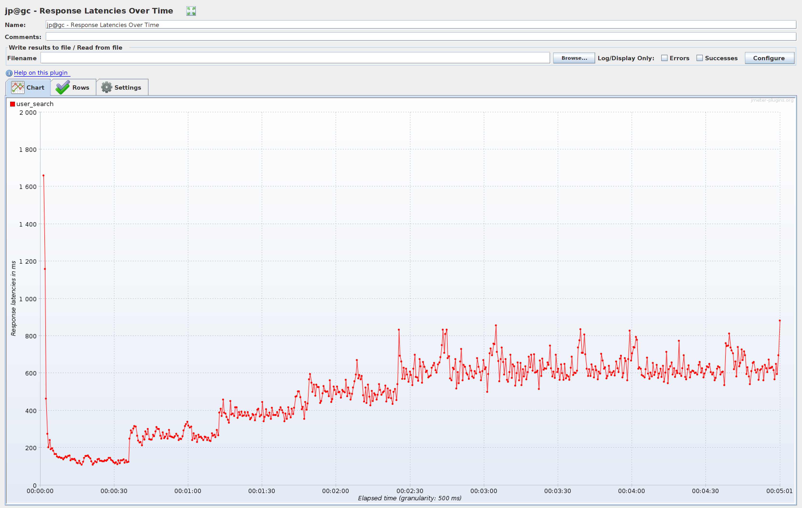
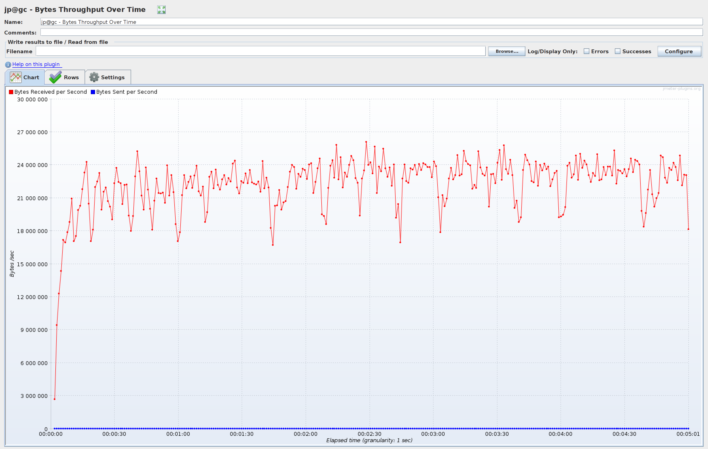

## Состояние таблиц

```sql
show table status from `socialnetdb`
```
Вывод
```
+-----------------------+--------+---------+------------+------+----------------+-------------+-----------------+--------------+-----------+----------------+---------------------+---------------------+------------+--------------------+----------+----------------+---------+
| Name                  | Engine | Version | Row_format | Rows | Avg_row_length | Data_length | Max_data_length | Index_length | Data_free | Auto_increment | Create_time         | Update_time         | Check_time | Collation          | Checksum | Create_options | Comment |
+-----------------------+--------+---------+------------+------+----------------+-------------+-----------------+--------------+-----------+----------------+---------------------+---------------------+------------+--------------------+----------+----------------+---------+
| flyway_schema_history | InnoDB |      10 | Dynamic    |    3 |           5461 |       16384 |               0 |        16384 |         0 |           NULL | 2023-07-31 21:02:06 | 2023-07-31 21:02:07 | NULL       | utf8mb4_0900_ai_ci |     NULL |                |         |
| sessions              | InnoDB |      10 | Dynamic    |    0 |              0 |       16384 |               0 |            0 |         0 |           NULL | 2023-07-31 21:02:07 | NULL                | NULL       | utf8mb4_0900_ai_ci |     NULL |                |         |
| user_profiles         | InnoDB |      10 | Dynamic    |    0 |              0 |       16384 |               0 |            0 |         0 |           NULL | 2023-07-31 21:02:06 | NULL                | NULL       | utf8mb4_0900_ai_ci |     NULL |                |         |
| users                 | InnoDB |      10 | Dynamic    |    0 |              0 |       16384 |               0 |            0 |         0 |           NULL | 2023-07-31 21:02:06 | NULL                | NULL       | utf8mb4_0900_ai_ci |     NULL |                |         |
+-----------------------+--------+---------+------------+------+----------------+-------------+-----------------+--------------+-----------+----------------+---------------------+---------------------+------------+--------------------+----------+----------------+---------+
```

### Тесты до создания индекса

```sql
explain analyze
select * from `socialnetdb`.`user_profiles`
where first_name like 'Як%' and second_name like 'Як%'
```
Вывод
```
"-> Filter: ((user_profiles.first_name like 'Як%') and (user_profiles.second_name like 'Як%'))  (cost=110578.90 rows=12229) (actual time=991.989..997.062 rows=5 loops=1)
    -> Table scan on user_profiles  (cost=110578.90 rows=990779) (actual time=0.056..837.723 rows=1000000 loops=1)
"
```

Кол-во активных потоков 

Response latency  

Throughput  

### Создание индекса

Т.к. поиск анкет производится по префиксному совпадению значений в полях
first_name и second_name, создаем индекс по этим двум полям.
first_name на первом месте в списке полей, т.к. содержит более уникальную информацию (фамилии) 
и с большей вероятностью будет использован при поиске.

```sql
USE `socialnetdb`;
create index idx_user_profiles_first_second_names
    on socialnetdb.user_profiles (first_name, second_name);
```

### Тесты после создания индекса

```sql
explain analyze
select * from `socialnetdb`.`user_profiles`
where first_name like 'Як%' and second_name like 'Як%'
```
Вывод
```
"-> Index range scan on user_profiles using idx_user_profiles_first_second_names over ('Як' <= first_name <= 'Як????????????????????????????????????????????????????????????????????????????????????????????????????????????????????????????????????????????????????????????????????????????????????????????????' AND 'Як' <= second_name <= 'Як????????????????????????????????????????????????????????????????????????????????????????????????????????????????????????????????????????????????????????????????????????????????????????????????'), 
with index condition: ((user_profiles.first_name like 'Як%') and (user_profiles.second_name like 'Як%'))  
(cost=12990.85 rows=11642) (actual time=5.923..7.068 rows=5 loops=1)
"
```

Кол-во активных потоков 

Response latency 

Throughput  
